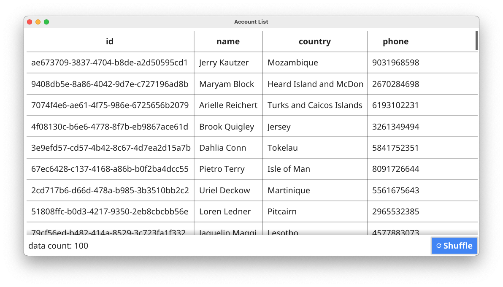

# data binding table

How to use widget.Table with data binding.

## References
- https://developer.fyne.io/tour/widget/table.html
- https://developer.fyne.io/api/v2.0/widget/table.html
- https://pkg.go.dev/fyne.io/fyne/v2@v2.0.4/widget#Table

- https://stackoverflow.com/questions/68085584/binding-table-data-in-go-fyne

