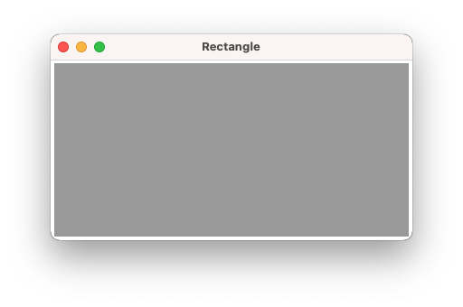
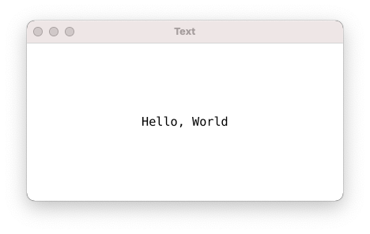
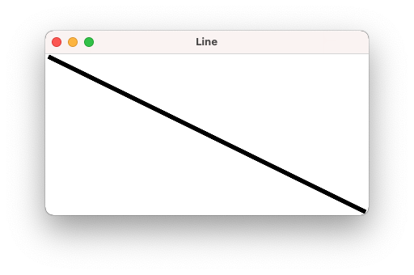
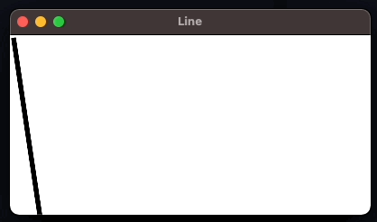
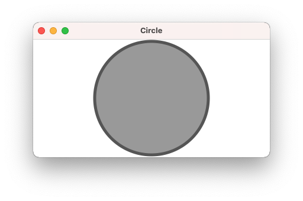
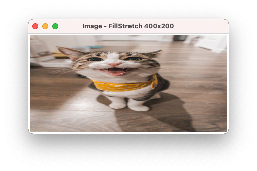
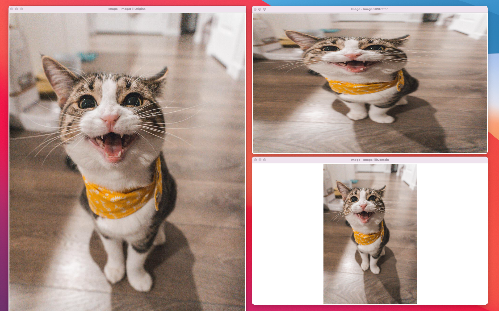
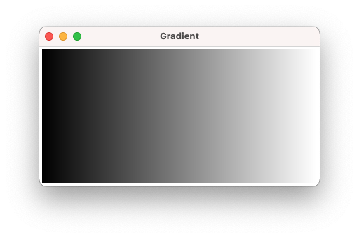

# basics

## Usage
`go run` コマンドでアプリケーションを起動:

    go run main.go

## Rectangle
https://developer.fyne.io/tour/canvas/

`canvas.Rectangle` は、指定された色のブロックを表示するシンプルな canvas オブジェクトです。色の設定は FillColor フィールド に対して行います。

```go
c := color.Gray16{0x9999}
rect := canvas.NewRectangle(c)
// or `rect := &canvas.Rectangle{FillColor: c}`
win.SetContent(rect)
```



なお、`Rectangle` が唯一のコンテンツである場合には、ウィンドウが埋まります。

## Text
https://developer.fyne.io/tour/canvas/text.html

`canvas.Text` は、Fyne における全てのテキスト表示に使用されます。text オブジェクト はテキストと文字色を指定して作成します。描画されるフォントは、カレントテーマで指定されたものがデフォルトで採用されます。

text オブジェクト は、`Alignment` や `TextStyle` フィールドなどのような特定の設定を行うことができます。

```go
text := canvas.NewText("Hello, World", color.Black)
text.Alignment = fyne.TextAlignCenter
text.TextStyle = fyne.TextStyle{
    Italic:    true,
    Monospace: true,
    Bold:      false,
}
child.SetContent(text)
```




## Line
https://developer.fyne.io/tour/canvas/line.html

`canvas.Line` は、２つの位置を結ぶ直線を描くオブジェクトです。２つの位置 `Position1` と `Position2` は規定ではそれぞれウィンドウの 左上頂点(top, left) と 右下頂点(bottom, right) を指しています。また、直線の色とストロークの幅を変えることができます。

```go
line := canvas.NewLine(color.Black)
line.StrokeWidth = 5
win.SetContent(line)
```




```go
lsize := fyne.Size{Width: 400, Height: 200}
for {
    if lsize.Width < 0 {
        lsize.Width = 400
    }
    time.Sleep(time.Millisecond * 100)
    lsize.Width--
    line.Resize(lsize) // Resize は、右下頂点の座標を指定
    canvas.Refresh(line)
}
```



## Circle
https://developer.fyne.io/tour/canvas/circle.html

`canvas.Circle` は、指定された色で塗りつぶされた円を定義するのに使用されます。円周の線に対しては、`StrokeWidth` および `StrokeColor` が指定できます。

```go
circle := canvas.NewCircle(color.Gray{0x99})
circle.StrokeColor = color.Gray{0x55}
circle.StrokeWidth = 5
child.SetContent(circle)
```



円は、デフォルトでは親要素を埋める様に表示されますが、その際には theme の指定にしたがって padding が適用されます。

## Image
https://developer.fyne.io/tour/canvas/image.html

`canvas.Image` は、Fyne における画像表示用のオブジェクトです。Image は URI や ローカル画像ファイル、メモリ上の `io.Reader` や `image.Image` などから読み込むAPIが用意されています。

```go
img := canvas.NewImageFromFile("sample.jpg")
window.SetContent(img)
window.Resize(fyne.Size{Width: 400, Height: 200})
window.Show()
```



デフォルトの フィルモード は、 `canvas.ImageFillStretch` であり、これは `Resize()` や layout で指定された領域を画像で埋める挙動をします。例えば、上記の例では元画像のサイズに関係なく ウィンドウ400x200 を埋める様に表示されているため、画像のアスペクト比が崩れています。

なお、`canvas.ImageFill` には、以下の３パターンが用意されていました。

- `ImageFillStretch`
- `ImageFillContain`
- `ImageFillOriginal`



## Raster
https://developer.fyne.io/tour/canvas/raster.html#

`canvas.Raster` は、`Image` と類似ではありますが、スクリーンのピクセルごとに１点を描画してゆく機能が提供されます。ユーザがウィンドウを広げたりした場合には、拡張されたピクセルを埋める必要があります。その様な場合は、以下のとおり、 `Generater` 関数にしたがってピクセルの色を指定することができます。

```go
w := myApp.NewWindow("Raster")

raster := canvas.NewRasterWithPixels(
    func(_, _, w, h int) color.Color {
        return color.RGBA{uint8(rand.Intn(255)),
            uint8(rand.Intn(255)),
            uint8(rand.Intn(255)), 0xff}
    })
// raster := canvas.NewRasterFromImage()
w.SetContent(raster)
w.Resize(fyne.NewSize(120, 100))
```

## Gradient
https://developer.fyne.io/tour/canvas/gradient.html

`canvas.Gradient` は、指定されたある色を起点とし、他方の色へのグラデーションを描画するためのオブジェクトです。グラデーションの方向により 以下の３つが用意されています。

- `NewHorizontalGradient()` : 水平方法
- `NewVerticalGradient()` : 垂直方法
- `NewRadialGradient()` : 同心円方法

```go
	myApp := app.New()
	w := myApp.NewWindow("Gradient")

	gradient := canvas.NewHorizontalGradient(color.Black, color.Transparent)
	//gradient := canvas.NewRadialGradient(color.Black, color.Transparent)
	w.SetContent(gradient)

	w.Resize(fyne.NewSize(400, 200))
	w.ShowAndRun()
``` 


